# Relatório – Tabelas Hash em Java

## Curso
Bacharelado em Ciência da Computação

## Disciplina
Resolução de Problemas Estruturados em Computação

## Professor
Andrey Cabral Meira

## Integrantes
- Adryan Costa Silva
- Hassan Ali El Gazouini
- Hussein Ali El Gazouini
- Murilo Zimerman Fortaleza

---

## 1. Introdução
O objetivo deste trabalho é implementar e analisar o desempenho de diferentes tabelas hash em Java, utilizando técnicas de **rehashing** e **encadeamento**. Foram escolhidas três funções hash diferentes:

- **Double Hashing** – Rehashing com hash duplo.
- **Multiplication Hash** – Encadeamento utilizando o método da multiplicação.
- **Quadratic Hash** – Rehashing com função quadrática.

Foram avaliados: tempo de inserção, número de colisões, gaps entre elementos e tempo de busca.

---

## 2. Metodologia

### 2.1 Estrutura de dados
- Cada elemento inserido na tabela é um objeto da classe `Registro` contendo um código de 9 dígitos.
- Para encadeamento, foi utilizada uma lista ligada simples (`Node`) para armazenar múltiplos elementos na mesma posição da tabela.

### 2.2 Tamanhos das tabelas
Foram testados três tamanhos de vetor para cada função hash:
- Pequeno: 1.000 posições
- Médio: 10.000 posições
- Grande: 100.000 posições

Para testes adicionais, usamos 9.000 inserções em uma tabela de 10.000 posições para avaliar os gaps.

### 2.3 Conjuntos de dados
- Cada conjunto possui **10000, 100000 e 1000000** elementos gerados aleatoriamente.
- Foi utilizada uma **seed fixa** para garantir que a geração dos dados em todas as funções hash fossem a mesma.

### 2.4 Escolha das funções
- **Double Hashing (Rehashing com duas funções):**

  Escolhido para avaliar o desempenho do rehashing duplo, que distribui melhor os elementos e evita clusters lineares, sendo eficiente em tabelas de tamanho médio e grande.
- **Quadratic Hash (Rehashing com função quadrática):**

  Escolhido para comparar com o Double Hash e observar como a função quadrática pode reduzir colisões em tabelas densas sem necessidade de encadeamento.
- **Multiplication Hash (Encadeamento):**

  Escolhido para testar a eficiência do encadeamento, que permite armazenar múltiplos elementos na mesma posição do vetor, evitando problemas de saturação em grandes conjuntos.

### 2.5 Medidas de desempenho
Para cada combinação tabela/função hash foram calculados:
- Tempo total de inserção (ns e ms)
- Número de colisões
- Maior, menor e média de gaps (espaços vazios)
- Tempo total de busca
- Para encadeamento: comprimento das 3 maiores listas

---

## 3. Resultados

### 3.1 Double Hash

| Tabela | Inserções | Tempo Inserção (ms) | Colisões    | Min Gap | Max Gap | Avg Gap | Tempo Busca (ms) |
|--------|-----------|-------------------|------------|--------|--------|---------|----------------|
| 1000   | 10000     | 1192,772          | 9.005.669  | 0      | 0      | 0,00    | 0,396          |
| 10000  | 100000    | 13.313,828        | 900.072.088| 0      | 0      | 0,00    | 1,013          |
| 100000 | 1000000   | 387.264,526       | 90.000.812.990 | 0   | 0      | 0,00    | 9,176          |
| 10000  | 9000      | 1600,170          | 23.655     | 1      | 6      | 1,12    | 2,486          |

### 3.2 Multiplication Hash (Encadeamento)

| Tabela | Inserções | Tempo Inserção (ms) | Colisões | Min Gap | Max Gap | Avg Gap | Tempo Busca (ms) | Top 3 Listas |
|--------|-----------|-------------------|----------|--------|--------|---------|----------------|--------------|
| 1000   | 10000     | 1350,495          | 49.648   | 0      | 0      | 0,00    | 2,644          | 23, 20, 20   |
| 10000  | 100000    | 12.081,619        | 499.418  | 0      | 0      | 0,00    | 8,668          | 25, 23, 23   |
| 100000 | 1000000   | 126.444,102       | 5.002.137| 1      | 1      | 1,00    | 39,181         | 26, 26, 26   |
| 10000  | 9000      | 1179,875          | 4.030    | 1      | 9      | 1,68    | 2,138          | 7, 6, 6      |

### 3.3 Quadratic Hash

| Tabela | Inserções | Tempo Inserção (ms) | Colisões    | Min Gap | Max Gap | Avg Gap | Tempo Busca (ms) |
|--------|-----------|-------------------|------------|--------|--------|---------|----------------|
| 1000   | 10000     | 1025,130          | 9.004.646  | 0      | 0      | 0,00    | 0,496          |
| 10000  | 100000    | 11.303,311        | 900.066.576| 0      | 0      | 0,00    | 1,699          |
| 100000 | 1000000   | 342.569,568       | 9.000.012.804 | 0   | 0      | 0,00    | 12,619         |
| 10000  | 9000      | 1463,219          | 15.679     | 1      | 4      | 1,18    | 0,962          |

---

## 4. Gráficos

- **Double Hash - Tempo de Inserção po Tamanho da Tabela (ms)**  
  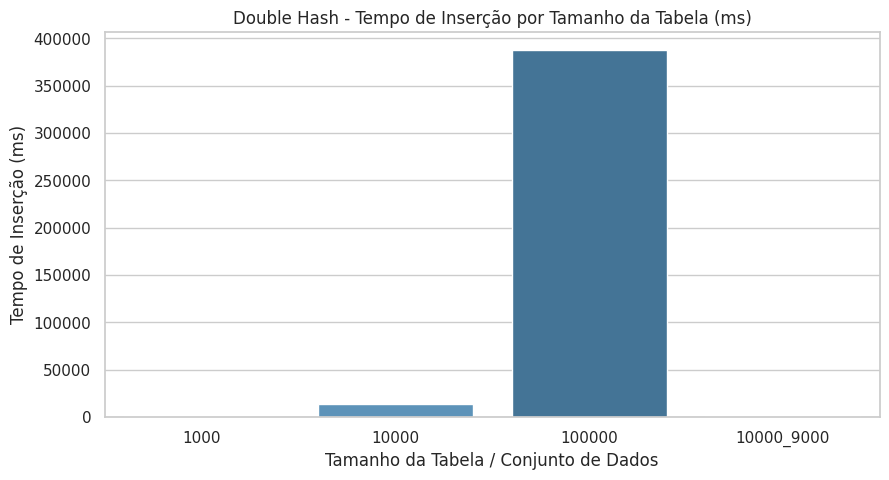
- **Double Hash - Colisões por Tamanho da Tabela**
  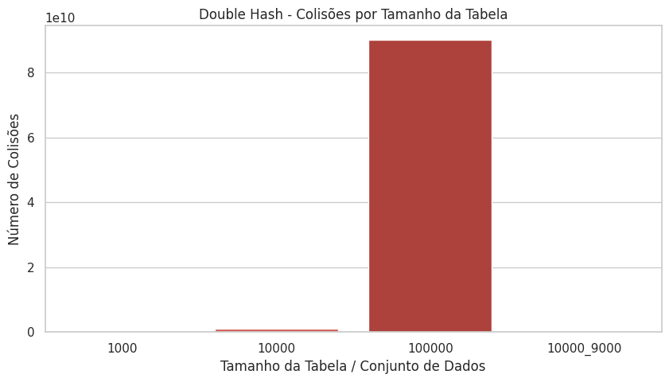
- **Double Hash - Tempo de Busca por Tamanho da Tabela (ms)**  
  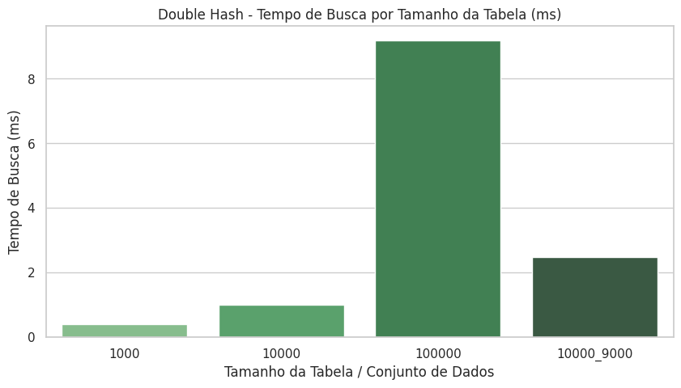
    

- **Multiplication Hash - Tempo de Inserção por Tamanho da Tabela (ms)**
  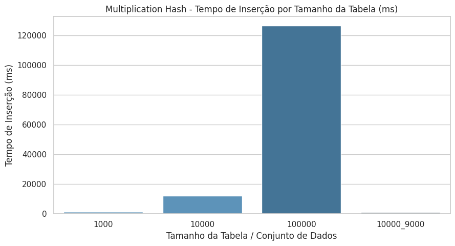
- **Multiplication Hash - Colisões por Tamanho da Tabela**
  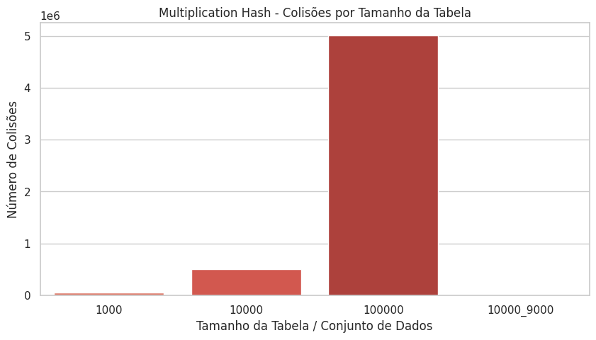
- **Multiplication Hash - Maior tamanho das listas encadeadas**
  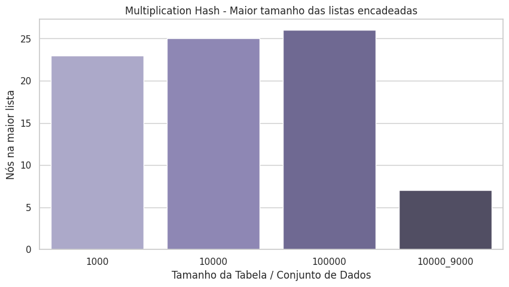
- **Multiplication Hash - Tempo de Busca por Tamanho da Tabela (ms)**
  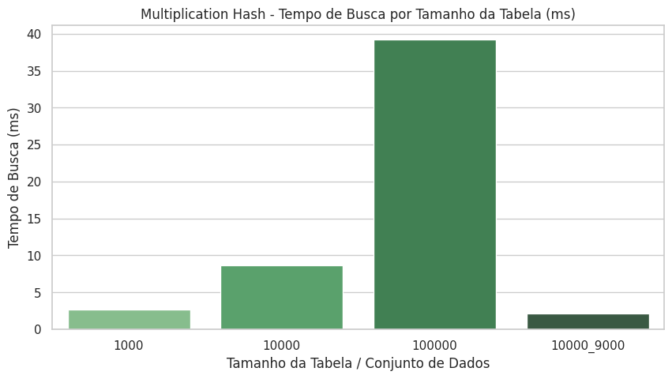

- **Quadratic Hash - Tempo de Inserção por Tamanho da Tabela (ms)**
  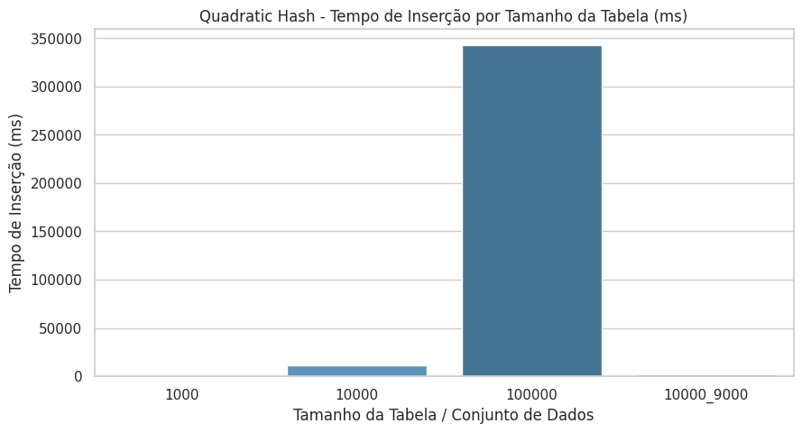
- **Quadratic Hash - Colisões por Tamanho da Tabela**
  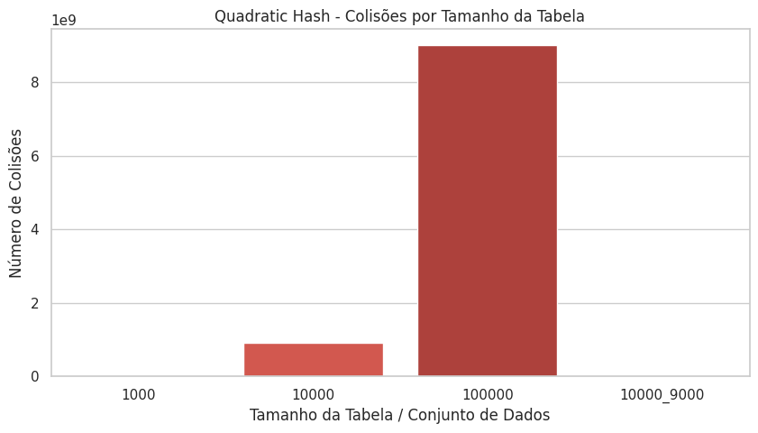
- **Quadratic Hash - Tempo de Busca por Tamanho da Tabela (ms)**
  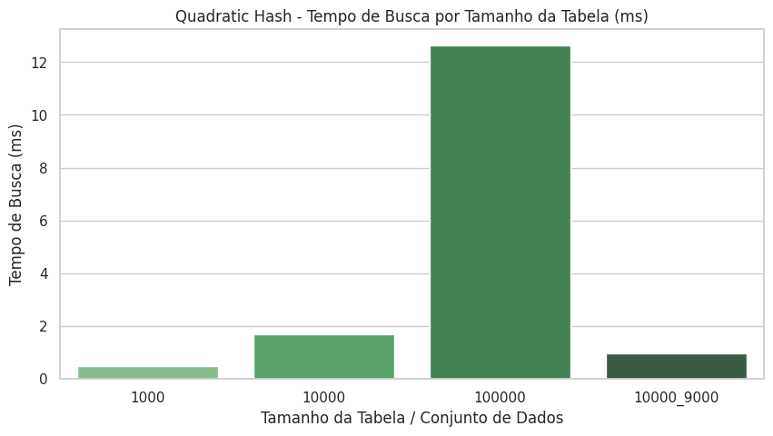

- **Comparação de Tempo de Inserção - Todos os Hashes**
  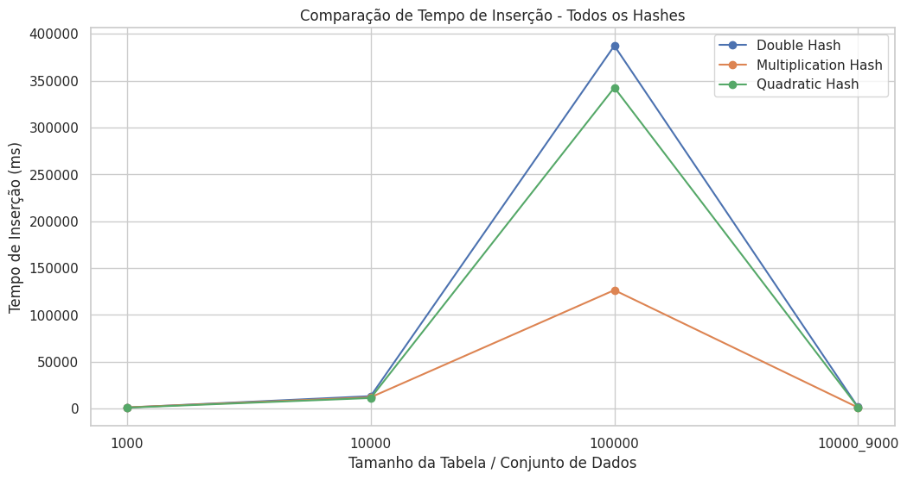
- **Comparação de Tempo de Busca - Todos os Hashes**
  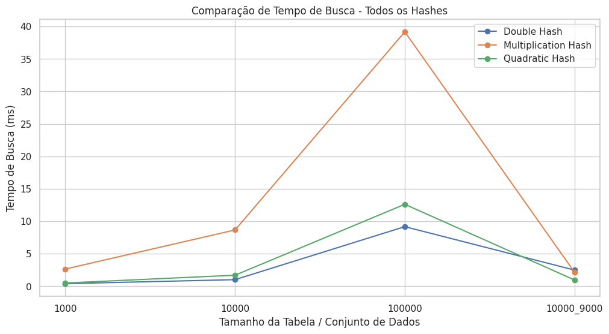
- **Comparação de Performance dos Hashes (Tempo de Inserção e Busca)**
  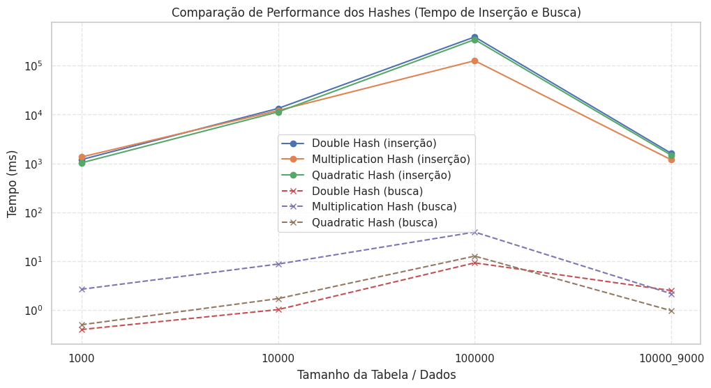

- **Analise de Performance Completa**
  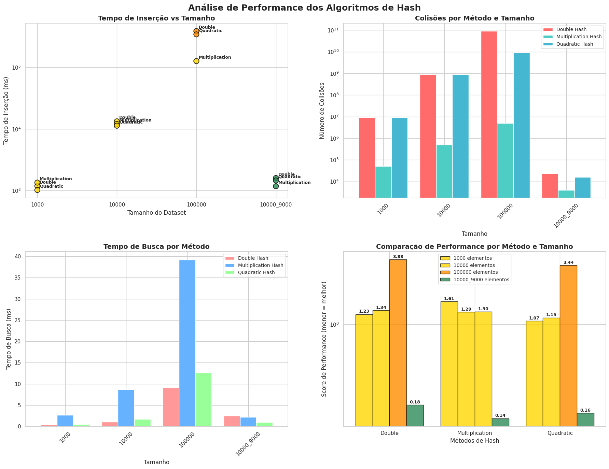

---

## 5. Discussão
- O **Double Hash** (Rehashing com duas funções) apresentou grande número de colisões em tabelas pequenas e médias, devido à alta densidade, mas tempos de busca baixos.
- O **Multiplication Hash** (Encadeamento) com encadeamento apresenta menor número de colisões, mas as listas encadeadas crescem com o aumento do número de elementos, aumentando o tempo de busca.
- O **Quadratic Hash** (Rehashing) teve comportamento intermediário em relação a colisões e tempos de inserção.

- Gaps foram praticamente zero em tabelas totalmente ocupadas, e mais relevantes quando o número de inserções foi menor que o tamanho da tabela.

- A escolha da função hash impacta diretamente a distribuição dos elementos e o desempenho, sendo o **Multiplication Hash** mais estável para grandes conjuntos com encadeamento.

---

## 6. Conclusão
- O trabalho confirmou que não existe uma função hash “perfeita”; a escolha depende do tamanho da tabela e do método de tratamento de colisão.
- Para conjuntos grandes, encadeamento pode ser mais eficiente em termos de colisões, mas consome mais memória e tempo de busca quando as listas crescem.
- Rehashing (Double e Quadratic) apresenta muitas colisões em tabelas densas, mas mantém as buscas rápidas.
- O estudo permitiu observar o comportamento de diferentes funções hash e entender a importância de medir tempos, colisões e gaps.

